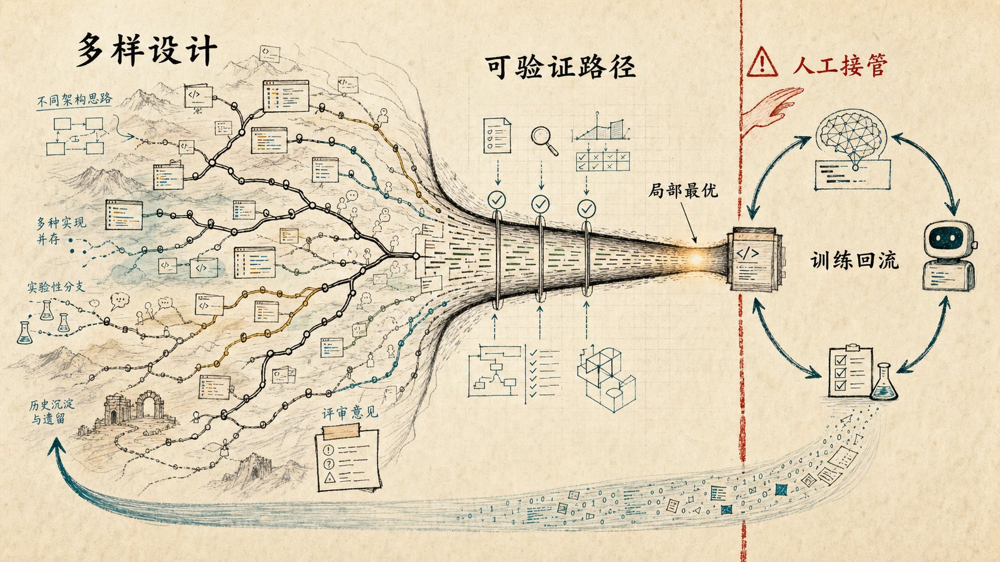

# AI 不只是在写代码，它正在重塑代码的形状

我最近使用 coding agent 的时候，越来越强烈地感觉到一件事：AI 编程改变的并不只是“谁来写代码”。

更深的变化是，我们和代码库的关系正在变。过去，代码主要是写给人读、给编译器跑、给团队维护。后来，代码还要适配 CI、lint、监控、自动化部署和各种平台约束。现在，代码库又多了一个新的读者和执行者：agent。

它要能读懂仓库结构，定位相关文件，理解任务边界，调用工具，运行测试，根据报错继续修改。于是，**好的代码库开始不只是“人类可维护”，还要“agent 可理解、可执行、可验证、可恢复”。**

这听起来像纯粹的进步。很多时候也确实是。agent 可以在几分钟内完成过去需要半天的搜索、试错和机械修改；它可以不疲劳地跑反馈循环；它会逼着团队把隐藏在脑子里的经验写进文档、脚本、测试和规范里。

> **核心判断：** 对普通软件开发，短期内这仍然是利大于弊的生产力红利；问题在于，它不是免费的红利。它会把代码库、流程和团队判断力，推向 agent 更容易优化的形状。如果缺少反向约束，这种红利长期可能变成一种局部最优。

对关键基础设施、医疗、金融、公共治理这类高风险系统，顺序还要反过来：它首先是控制权、可追责和可接管问题，其次才是生产力问题。

## 代码库正在变成 agent 的工作环境

以前我们说“工程化”，很多时候指的是让人协作更稳定：模块边界清楚，接口定义明确，测试能跑，部署可重复，日志能排障。

agent 出现以后，这些东西突然有了新的含义。它们不只是给人用的工程实践，也变成了 agent 的行动环境。

一个 agent 要在真实仓库里工作，需要几类东西：

- 明确的任务描述：它要知道这次修改的目标是什么，边界在哪里。
- 可探索的仓库结构：它要能通过文件名、目录、文档和搜索快速建立地图。
- 可执行的反馈：测试、构建、lint、类型检查、截图、日志，都要能告诉它“现在对不对”。
- 可恢复的工作流：改错了能回滚，跑失败能定位，权限和副作用有边界。
- 可沉淀的规则：团队偏好、架构约束、发布流程、安全红线，要能写进 agent 可以读取的地方。

这也是为什么 OpenAI、Anthropic 等一线实践都在把 coding agent 描述成一种闭环系统：探索、计划、执行、验证、迭代。模型本身很重要，但更重要的是它被放进了什么环境，有没有工具，有没有检查器，有没有足够清楚的约束。

这会自然产生一种收敛压力：更容易被 agent 理解的结构、测试、日志和任务拆分，会更容易被团队采用。慢慢地，代码库不是单纯按照人的审美、历史习惯和业务边界生长，也会按照 agent 的可读性、可操作性和可验证性重新组织。

这就是我说的：**AI 不只是在写代码，它正在重塑代码的形状。**

## 这为什么短期是好事

先不要急着把这件事说成坏事。很多工程问题，过去坏就坏在太依赖人的临场记忆。某个脚本为什么这么写，某个配置为什么不能改，某个服务为什么上线前要手动检查一项指标，知道的人可能只有两个，其中一个已经转组。

agent 要能工作，团队反而必须把这些隐性知识显性化：文档、测试、可复现环境和明确的失败信号都要补上，否则它就会乱猜、误改、反复撞墙。

从这个角度看，agent-first 的代码库会逼出更好的工程卫生：README 和任务说明更清楚，一键测试和构建更稳定，发布经验更少依赖口口相传，模块边界、命名和变更证据也更明确。

这也是 AI 编程最实际的价值之一。它不是简单替代一个工程师敲键盘，而是把“写代码”这个动作，拆成环境、约束、反馈和搜索。

在结果可验证、失败可回滚、成本可承受的普通互联网服务里，这个模式很强。代码库向 agent 友好本身不是问题；麻烦在于：当一套短期反馈机制足够有效，它会开始改造整个环境。

## 风格被抹平只是表层

你可能看过类似这样的说法：[AI 读完一个代码库，把许多工程师的个人风格全部抹平，然后说“现在一致了”](https://mp.weixin.qq.com/s/5CvxW8ntDyY5qzZRPco70Q)。

这个现象有意思，但它只是表层。代码风格被统一，本身未必是坏事。团队本来就会使用 formatter、lint、review 规范来消除无意义差异。要警惕的，不是“每个人的代码看起来不一样”这件事消失了，而是更深一层的差异也可能被抹平：

- 不同工程师对异常路径的敏感度。
- 不同团队对抽象边界的取舍。
- 不同架构风格对未来变化的预留。
- 不同产品判断对“什么值得做”的偏好。
- 不同组织对风险、速度、可靠性的排序。

这里要先把两件事分开。随意命名、重复造轮子、历史包袱和审美分歧，能统一就应该统一。好的工程一致性会降低维护成本，也会让人和 agent 更容易判断系统是否偏离预期。

需要保留的，不是表面的不一致，而是经过验证后仍然成立的设计选择空间：不同模块是否有清楚的失败假设，接口边界是否能随业务变化重新切分，验证手段是否不只依赖同一种测试，关键路径是否有可替换方案。

危险不在于代码变得一致，而在于所有系统都被同一类模型、prompt、评测和模板推向一种未经充分讨论的“一致”。这种一致可能很整洁，却把备用假设和替换空间一起消掉。

AI 很擅长学习既有模式，并把它们压缩成一种“最像正确答案”的输出。当 agent 在一个仓库里反复修改代码，它会倾向于选择最容易解释、最容易通过测试、最符合现有局部模式的方案。

这在短期内很有效。它减少摩擦，提高一致性，降低新任务的启动成本。

所以问题不是“要不要一致”，而是“一致来自哪里”。如果所有团队都围绕类似的模型、类似的评测器、类似的工具接口和类似的最佳实践来组织软件，差异会从更底层开始减少。代码风格趋同只是最容易看见的一层。更深的是接口趋同、验证方式趋同、任务拆分方式趋同、组织判断方式趋同。

这时候，我们要问的就不是“AI 写的代码有没有个人风格”，而是：

**软件工程会不会越来越像少数顶级模型最容易优化的那种游戏？**

举个小例子。一个 agent 为了修接口 bug，先补了单元测试，又为了让测试稳定，把外部依赖换成 mock，最后把运行命令写进项目说明文件。单次看，这些都合理。做多了以后，团队会自然把任务拆成它最容易定位、修改、验证的小块，代码库也会向这种工作方式靠拢。

## 强大的局部最优会重塑环境

所谓局部最优，不是说它不好。一个 coding agent 最容易发挥作用的环境，通常是任务清楚、结构常见、测试完备、反馈快、错误定位直接、改动范围局部、成功标准明确。

在这样的环境里，agent 的优势不是抽象的“聪明”，而是能低成本地反复尝试。它比人更有耐心，也更适合大规模重复。

于是团队会自然地把更多任务改造成这种形状。需求写得更像 prompt，代码库写得更像 agent 的搜索空间，测试写得更像机器可执行的验收信号，review 写得更像可复查的评估流程，工程师的工作变成设计约束和处理异常。

这就是局部最优的力量：它不是强迫你改变，而是让你觉得“这样做效率最高”。

问题也在这里。任何可优化系统都会诱导环境向指标靠拢：只看 KPI，团队就会优化 KPI；只看点击率，产品就会优化点击率；只看测试通过，代码就会优化测试通过。

agent 编程也一样。如果只奖励“任务完成得快”“测试一次通过”“PR 很快合并”“issue 数下降”，系统就会朝这些指标收敛。至于两周后的可维护性、半年后的架构弹性、异常场景下的可恢复性、团队对代码的真实理解，未必会自动保留下来。

这会直接影响长期维护。维护看的不只是今天能不能测试通过，而是环境变化以后，系统还能不能被人理解、拆开、迁移和接管。

如果一致性来自清楚的架构判断和长期验证，它当然是好事。团队知道为什么这么做，也知道什么情况下可以偏离它。问题出在另一种情况：更多代码都被推向同一种“容易解释、容易测试、容易修补”的写法，但这种写法背后的假设没有被说清，也没有被持续挑战。

这就是未经判断的单一路径收敛会让维护变脆的原因。同一类 prompt 会带出相似的抽象，同一类评测会漏掉相似的边界条件，同一类模板会复制相似的安全和性能盲区。它不是某一段代码质量差，而是整个系统越来越依赖同一套没有被明说的假设。等业务边界、依赖、流量形态或合规要求变了，系统可能仍然很会通过旧测试，却不再容易被人接手。

一些现实研究已经给了类似信号。DORA 的报告提示，AI 采用和交付稳定性下降、变更批量变大之间存在相关性；GitClear 对 2020-2024 年代码变更的观察也指出，AI 高采用环境下可能伴随重复代码增加、短期 churn 增加，以及 moved lines 下降。这些不是因果证明，但足以提醒团队不要只看产出速度。

这些结论不意味着 AI 编程没有价值。它们说明的是：**AI 把局部搜索和产出速度推得很高，但它不会自动替我们解决全局架构、长期维护和责任归属问题。**

## 人类不是退出，而是换位置

很多关于 AI 编程的讨论，会落到一个简单问题：以后还需不需要程序员？

我觉得这个问法太粗了。更准确的问题是：人类在软件系统里的位置会移动到哪里？

过去，一个工程师的价值很大一部分体现在亲手完成实现：理解需求，写代码，调 bug，补测试，处理上线问题。以后，这些动作里会有越来越多被 agent 接手或半接手。

但这不等于人类退出，而是位置上移。人类不应该把自己的价值理解成“继续亲手敲每一行代码”。人类要守住的是目标、边界、解释权、异常处置权和最终责任。

落到工程上，有四条原则会越来越重要。

> **一句话版本：** 让系统对 agent 友好，但不要让组织只围着 agent 的局部最优运转。

**第一，让代码库对 agent 友好，但不要只对单一 agent 友好。**

可以有 AGENTS.md、CLAUDE.md 或类似说明文件，可以有明确的测试钩子、脚本入口、日志规范和自动化检查。但关键知识不要只写成某个模型、某个工具、某个厂商最顺手的格式。

好的 agent-friendly 代码库，应该同时也是 human-friendly、tool-friendly、model-neutral 的代码库。它可以被不同模型读取，可以被人类审查，可以在工具替换时继续工作。

**第二，把验收标准前置。**

试图人工审查每一行 AI 生成代码，很快会变得不可持续。更有效的方式是任务开始前写清：这次修改的成功证据是什么？必须跑哪些测试？哪些文件不该碰？哪些行为必须截图或日志证明？出错后怎么回滚？

人类不是每一步都点头的橡皮图章，而是设计约束、验收标准和异常裁决的人。

**第三，用维护性指标约束速度指标。**

不要只看提交量、关闭 issue 数、生成代码行数、PR 合并速度。还要看重复代码比例、回滚率、事故关联率、两周后的返工率、重构比例、review 争议点，以及人类是否还能解释关键模块。

如果组织只奖励速度，agent 会帮助组织系统性地牺牲长期质量。

**第四，高风险系统必须保留独立验证和人工接管权。**

普通互联网服务可以更激进地试错，因为失败可以回滚，影响相对可控。但关键基础设施、医疗、金融、公共治理和安全相关系统不一样。

这些系统不能把“模型能跑通”当成“系统可信”。它们需要独立评测、冗余机制、审计记录、可停用设计和明确的人类责任节点。NIST AI 600-1 已经把同质化、人机配置、供应链和组件集成、可停用或快速终止能力等纳入生成式 AI 风险管理动作。放到 coding agent 场景里，重点是独立验证、审计和接管。

## 最后：世界会不会也在向模型收敛？

如果只看软件工程，这个问题已经足够大了。但它还有一层更远的含义：软件并不只是代码。软件正在组织交易、内容分发、城市运行、企业管理、教育流程、医疗辅助和公共服务。代码库的形状，某种程度上也是世界运行方式的一部分。

当越来越多代码、流程、产品决策和组织判断由少数顶级模型参与生成，世界会不会也开始向这些模型更容易理解和优化的形状收敛？

我现在还不愿意把它说成一个确定的灾难。短期内，agent 确实会让很多原本混乱、隐性、低效的工程流程变得更清楚、更可验证、更可自动化。

但越是强大的工具，越会改造使用它的环境。值得警惕的，不是 AI 写了多少代码，也不是代码有没有保留工程师的个人风格，而是：**我们有没有意识到，自己正在把代码库、工作流、组织判断，甚至一部分世界运行方式，改造成机器更容易优化的形状。**

保留多样性、独立验证、可回退机制和人类最终决策权，这可能是一次巨大的工程升级；只追逐速度，把判断交给同一类模型、同一套评测器和同一种局部最优，**它就会从生产力红利，变成一种很难察觉的治理赤字。**

## 参考资料

- [OpenAI: Harness engineering: leveraging Codex in an agent-first world](https://openai.com/index/harness-engineering/)：关于把仓库知识、DevTools、可观测性和任务环境暴露给 Codex，形成 agent-first 工程环境。
- [OpenAI: A practical guide to building agents](https://cdn.openai.com/business-guides-and-resources/a-practical-guide-to-building-agents.pdf)：关于 agent 的模型、工具、指令、护栏和编排。
- [Anthropic: Building effective agents](https://www.anthropic.com/research/building-effective-agents) 与 [Claude Code best practices](https://code.claude.com/docs/en/best-practices)：关于简单可组合的 agent 模式、项目说明文件、工具使用和验证循环。
- [DORA: Impact of Generative AI in Software Development](https://dora.dev/ai/gen-ai-report/)：关于 AI 采用与吞吐、稳定性、批量变更之间的关系。
- [GitClear: AI Copilot Code Quality 2025](https://www.gitclear.com/ai_assistant_code_quality_2025_research)：关于重复代码增加、短期 churn 增加和 moved lines 下降等代码质量信号。
- [NIST AI 600-1: Artificial Intelligence Risk Management Framework: Generative Artificial Intelligence Profile](https://www.nist.gov/publications/artificial-intelligence-risk-management-framework-generative-artificial-intelligence)：关于生成式 AI 风险治理，包括同质化、人机配置、供应链和停用机制等问题。
