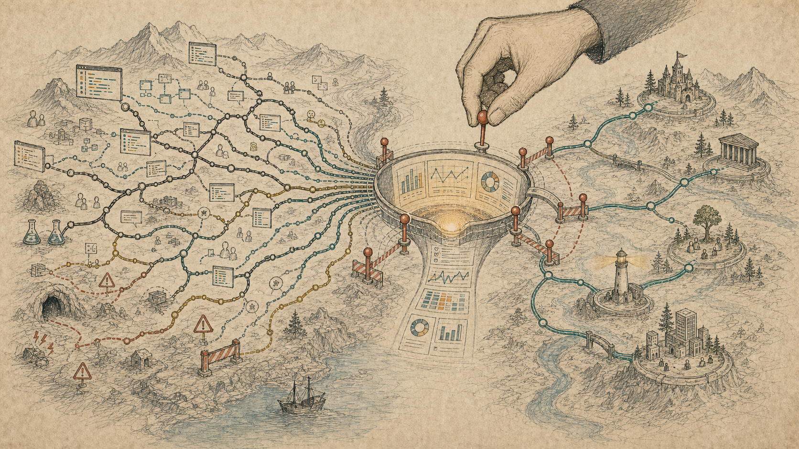

# 当 AI Agent 开始优化团队指标，如何避免陷入局部最优？

这个系列前两篇分别讨论了代码库和理解问题。

AI 不只是在写代码，它正在重塑代码库的形状。Agent-friendly 也不必然牺牲人类可理解性，但它必须最终服务于人类理解和接手。

这篇文章想把问题再往上移一层。即使不看前文，也可以把它理解成一个独立的问题：当 AI Agent 不只参与写代码，也开始参与优化团队指标，研发组织该如何避免陷入局部最优？

如果说前两篇讨论的是代码库，那么这篇讨论的是组织。更具体一点，是软件研发团队的目标函数。

当 AI Agent 进入真实研发流程以后，它不只是帮工程师写代码、跑测试、改 PR。它也会进入团队的指标体系：交付速度、issue 关闭数、PR 周期、review 响应时间、缺陷修复时长、AI 使用率、自动化覆盖率。

这些指标本来都有价值。没有指标，团队很难知道自己是否在变好；没有可观察信号，管理者只能靠感觉判断；没有交付和稳定性数据，组织也很难区分真正的效率提升和表面忙碌。

但问题在于：**AI Agent 很擅长优化指标。**

它可以把需求拆得更细，可以更快生成 PR，可以自动补测试，可以批量回应 review，可以把一个复杂任务拆成很多看起来已经完成的小任务。它不会疲劳，也不会厌烦重复劳动。

这当然能带来生产力红利。可一旦团队把某些代理指标当成目标本身，agent 也会帮助团队更快地走向那个目标，哪怕那个目标并不等于真正的工程质量、用户价值和长期可维护性。

> **核心判断：** AI Agent 最大的组织风险，不是把指标做不好，而是把不完整的指标做得太好。当团队把速度、产出、关闭数量或 AI 使用率当成目标函数时，agent 会帮助组织更快地抵达局部最优，也更快地偏离真正重要但难以度量的东西。

所以组织篇的问题不是“要不要用 AI 提效”。

更准确的问题是：**当 AI 开始参与优化研发指标，团队还知不知道自己真正想优化什么？**

## 指标不是现实，只是现实的影子

软件团队需要指标。

变更前置时间、部署频率、变更失败率、失败部署恢复时间、部署返工率，可以帮助团队看见交付系统的健康状况。review 周期、构建等待时间、测试耗时、返工比例，可以帮助团队发现研发流程的摩擦。用户留存、性能、稳定性、事故数量，可以帮助团队判断技术变化有没有转化成真实价值。

问题不是指标本身。

问题是，当指标进入绩效、预算、晋升和管理汇报以后，它就不再只是观察工具，而会变成行动环境。

这不是 AI 时代才有的现象。

Goodhart's law 常被概括为：当一个度量变成目标，它就不再是一个好的度量。Campbell's law 说得更直白：量化指标越被用于社会决策，越容易受到腐蚀，也越容易扭曲它原本要监测的过程。

这两条规律放到研发团队里，并不难理解。

如果组织只看 PR 数量，团队会拆出更多 PR。  
如果组织只看 issue 关闭数，团队会更偏好关闭容易关闭的问题。  
如果组织只看交付速度，团队会把不容易立刻产生交付的工作往后推。  
如果组织只看 AI 使用率，团队会开始把“用了 AI”当成进步本身。

这些行为未必是作弊。多数时候，它只是理性适应。

人会适应指标，团队会适应指标，agent 也会适应指标。区别在于，agent 把这种适应变得更便宜、更快、更连续。

过去，一个团队想刷指标，还需要大量人工协调。现在，很多表面产出都可以被自动化：拆任务、生成说明、补测试、改格式、回应评论、整理周报、重写 commit message、补齐文档段落。

这会造成一个微妙变化：**组织不一定更接近真实目标，但会更快接近可见目标。**

## AI 会把瓶颈从写代码移到目标函数

很多关于 AI 编程的讨论，仍然停在“写代码快不快”。

这个问题当然重要，但它不是组织层面最完整的问题。

现实证据本身也不适合被简化成一句话。有些受控实验显示，代码助手能显著缩短特定任务完成时间；也有针对熟悉开源仓库的受控研究发现，在 2025 年上半年一组 AI 编程工具下，有经验开发者处理成熟项目任务时未必提速，甚至可能因为提示、等待、审查和上下文判断增加总耗时。

这些结论并不矛盾。它们共同说明的是：AI 是否提高研发效率，不只取决于模型能力，也取决于任务类型、代码库状态、验证手段和组织流程。

在一个真实团队里，写代码只是研发系统中的一段。需求要不要做，边界有没有说清，依赖团队是否对齐，测试是否能表达风险，review 是否有足够上下文，发布以后是否能观测，出了问题能否恢复，这些都在决定最终结果。

AI Agent 会显著降低局部实现的成本。它可以让某些任务更快进入 PR，更快通过第一轮测试，更快形成可展示的进展。

但当实现成本下降以后，系统瓶颈会转移。

过去团队慢，可能慢在写代码。以后团队慢，更多会慢在别处：需求是否值得做，任务是否拆对了，谁来判断异常路径，review 人是否有时间，CI 是否承受得住，发布节奏是否安全，线上反馈是否能回到下一轮决策。

如果组织没有意识到这个瓶颈转移，就很容易用旧指标衡量新系统。

比如，一个团队引入 agent 以后，PR 数量明显上升，issue 关闭速度变快，短期看是好消息。但如果 review 队列开始堆积，变更批量变大，返工比例上升，事故复盘中出现更多“当时没有真正理解”的问题，那么团队得到的可能不是更高生产力，而是更快的局部吞吐。

DORA 系列研究对软件交付长期强调的价值，正在这里变得更重要：不要只看速度，也要看稳定性和恢复能力。SPACE 框架也明确反对用单一活动指标衡量开发者生产力。DevEx 研究进一步提醒，研发效率和目标清晰度、反馈速度、工具摩擦、协作环境有关，不是提交数量可以概括的。

这几类研究放在一起，给出的不是一组新 KPI，而是一个更基本的提醒：**生产力是系统性质，不是单点产出。**

AI 让单点产出变得更容易，反而要求团队更认真地定义系统目标。

## 局部最优不是失败，而是太容易成功

“局部最优”这个词，容易被理解成一种失败；但在组织里，它往往不是失败，而是太容易成功。

一个局部最优通常有几个特点：目标清楚，反馈快，成本低，成功可以被展示，责任容易归属。

这正是 agent 最喜欢的环境。

给它一个明确任务、一个可执行测试、一个清楚的 PR 边界，它就能快速循环。任务越局部，验证越明确，它越容易发挥作用。团队自然也会把更多工作改造成这种形状。

这在很多情况下是好事。它会逼团队清楚描述任务、补齐自动化、减少模糊沟通、缩短反馈周期。

问题出在另一边：软件研发里有很多重要工作，不适合被切成短期可见的小成果。

比如，重新讨论一个模块边界。  
比如，决定一个需求根本不值得做。  
比如，删除一套长期没人敢碰的旧逻辑。  
比如，训练新人理解复杂系统。  
比如，推动两个团队重新划分责任。  
比如，给一个高风险变更设计回滚和灰度策略。  
比如，承认一个季度目标本身设错了。

这些工作很重要，但它们不一定产出漂亮的 PR 数量，也不一定能在周报里被 agent 自动总结得很好看。

如果组织的目标函数只奖励“可见的完成”，这些工作会被挤出。不是因为大家不知道它们重要，而是因为它们在指标里没有位置。

Kerr 那篇经典文章讲的是“奖励 A，却希望得到 B”的荒谬。放到 AI 研发团队里，就是组织嘴上希望高质量、长期可维护、用户价值和工程判断，实际却奖励更多产出、更快关闭、更高自动化比例。

Agent 不会纠正这种错配。它会放大这种错配。

## 代理指标会变成 agent 的奖励函数

在第二篇文章里，我写过一句话：测试可能被当成 agent 的奖励函数。

组织层面也一样。

研发指标会变成团队和 agent 的奖励函数。

这并不是说每个团队都会故意刷数据。更常见的情况是，指标慢慢改变了“什么值得做”的感觉。

一个工程师原本想花两天时间重构一段边界模糊的逻辑，但这件事很难在短期指标里解释。与此同时，agent 可以帮他一天内关掉三个小 issue，补上几个测试，再生成一份看起来完整的变更说明。哪件事更像“有产出”？答案不言自明。

一个团队原本应该停下来复盘线上事故，但当季度目标压着交付节奏，agent 又能迅速补出修复 PR，团队就可能把复盘压缩成“修了、测了、过了”。看起来效率很高，实际上只是把学习成本推迟了。

一个管理者原本应该判断需求是否值得做，但 agent 让实现变得很便宜，于是更多需求被推进实现阶段。团队并不是更会选择，而是更少感受到选择错误的早期痛感。

这就是 AI Agent 和传统自动化的不同之处。

传统自动化通常只能优化某个固定流程。Agent 更像一个通用执行器，它可以把很多组织意图翻译成行动。只要目标函数给错，它就能很勤奋地把错的方向执行到底。

AI 安全研究里常说 specification gaming 或 reward hacking：系统找到了一种满足指标、但偏离真实意图的方式。这个问题放到研发组织里，不一定表现成戏剧化的“钻漏洞”。它更可能表现成一种安静的偏移：

团队越来越擅长完成被定义好的工作，越来越不愿意重新定义工作。  
团队越来越擅长提高交付吞吐，越来越少讨论不该交付什么。  
团队越来越擅长让 agent 跑起来，越来越少追问人是否还理解关键判断。

这不是某个 agent 的道德问题，而是目标函数设计问题。

## 人类要守住的不是每一步审批

一听到这类风险，很多组织会本能地把答案放到审批上。

AI 生成的代码要不要人看？PR 要不要人工通过？关键变更要不要负责人确认？这些当然重要。

但如果人类只是被放在流程末端点一下确认，效果很有限。

原因很简单：当上游目标函数已经偏了，下游审批很难救回来。更何况，在高吞吐的 agent 流水线里，人类审查者很容易变成瓶颈，也很容易产生自动化偏差：系统看起来已经通过测试、解释完整、格式规范，人就更难保持怀疑。

人类真正要守住的，不是每一步机械审批，而是更上游的几件事。

**第一，定义真实目标。**

这次引入 agent，是为了减少等待，还是为了降低事故，还是为了提高新人上手速度，还是为了清理历史债？不同目标对应完全不同的指标组合。

如果真实目标是减少事故，却只看修复速度，团队会更快修 bug，但未必减少 bug。  
如果真实目标是提升用户价值，却只看交付数量，团队会更快发布功能，但未必更接近用户问题。  
如果真实目标是增强工程能力，却只看 AI 使用率，团队会更熟练地使用工具，但未必更会判断。

**第二，定义反目标。**

组织不只要说“我们要什么”，也要说“我们不接受用什么代价换它”。

比如：

- 不接受通过扩大变更批量来换短期交付吞吐。
- 不接受通过压缩 review 时间来换 PR 周期。
- 不接受通过牺牲新人理解来换短期产出。
- 不接受通过绕过架构讨论来换 agent 执行效率。
- 不接受通过更高事故风险来换更多功能上线。

这些反目标如果不写进制度，只写在口号里，很快会输给可见指标。

**第三，定义停止条件。**

一个组织是否成熟，不只看它能不能加速，也看它知不知道什么时候该停。

SRE 里的 error budget 是一个很好的类比。它不是简单要求团队少发布，而是预先约定：可靠性预算还在的时候，可以更快试错；预算被消耗过多，就必须把注意力从速度切回稳定性。

AI 研发也需要类似机制。

如果 agent 生成变更导致返工显著上升，要停下来检查任务拆分和验收标准。  
如果 review 堆积，要限制并发产出，而不是继续催促 reviewer。  
如果事故复盘多次指向“人没有真正理解变更”，要降低自动化级别。  
如果重复代码、临时补丁和绕路实现增加，要把一部分 agent 时间转向重构和删除。

停止条件的价值在于，它把“克制”从个人美德变成组织机制。

## 指标应该成组出现，而不是单独统治

AI 时代的研发指标，不应该被理解成一个榜单，而应该被理解成一组互相制衡的信号。

速度、质量、稳定性、恢复能力、学习能力和用户价值，需要互相校准。  
速度不能脱离质量和稳定性，质量也不能变成拒绝变化的借口。  
恢复能力不只是事故后的修补速度，还要反过来推动团队学习。  
用户价值则要提醒团队：工程系统变快，最终仍然要服务真实问题。

如果只看速度，团队会牺牲质量。  
如果只看质量，团队可能变得保守。  
如果只看稳定性，团队可能避免必要变化。  
如果只看用户增长，团队可能透支工程系统。  
如果只看 AI 使用率，团队可能把工具采用误当成能力提升。

所以更合理的做法，是把指标分成几类。

**交付指标**看团队能不能把有价值的变化送到用户手里，比如变更前置时间、部署频率、需求从确认到上线的周期。

**稳定性指标**看系统能不能承受变化，比如变更失败率、事故数量、恢复时间、回滚比例。

**维护性指标**看今天的速度有没有透支未来，比如返工率、重复代码、临时补丁比例、重构和删除工作占比、两周后的缺陷复发。

**理解指标**看人类是否仍能掌握系统，比如关键模块是否有人能解释，重大变更是否有清楚的设计判断，事故复盘是否能说清“为什么当时这么做”。

**价值指标**看产出是否真的解决问题，比如用户行为、成本下降、风险降低、业务流程是否变简单。

这些指标不需要全部变成严格 KPI。相反，有些指标如果被强行量化，反而会被腐蚀。它们更适合作为复盘和管理对话的材料。

指标的目的不是替代判断，而是逼迫判断发生。

## 不要把 AI 使用率当成成熟度

接下来几年，很多团队会很自然地追踪 AI 使用率。

多少工程师使用了 coding agent？多少 PR 有 AI 参与？多少测试是 AI 补的？多少文档由 AI 生成？多少任务进入了自动化流水线？

这些数据可以看，但要非常小心。

AI 使用率最多说明工具被采用了，不说明团队变强了；它最容易制造的错觉，就是把“用了新工具”误当成“完成了组织升级”。

一个团队可能大量使用 AI，只是在生产更多短期补丁。另一个团队使用比例没那么高，却把 agent 放在最有效的位置：生成候选方案、跑机械验证、整理上下文、做对抗性 review、清理重复劳动，让人类把注意力放在目标、边界和异常判断上。

这两种团队在“AI 使用率”上可能前者更好，但在真实能力上未必。

如果一个团队想评估 AI 引入是否有效，更值得问的是：

- 需求澄清是否更充分？
- review 是否更有上下文？
- 返工是否下降？
- 事故是否更容易复盘？
- 新人是否更容易理解系统？
- 重构和删除是否变多，而不是只生成更多代码？
- 人类是否还能解释关键模块的关键判断？

这些问题不如使用率好看，也不容易自动统计，但它们更接近真实目标。

## 组织要保留重新定义问题的能力

Agent 最擅长的是在给定问题里搜索答案。

但很多组织真正需要的，不是更快回答问题，而是重新定义问题。

“这个需求怎么做？”之前，可能应该先问“这个需求要不要做？”  
“这个 bug 怎么修？”之前，可能应该先问“为什么这个模块总是在这里出问题？”  
“怎么让 agent 更快合并 PR？”之前，可能应该先问“为什么我们有这么多小 PR 需要合并？”  
“怎么提高 AI 使用率？”之前，可能应该先问“哪些工作不应该交给 AI？”

这类问题很难自动化，因为它们会挑战目标本身。

而任何组织一旦沉迷于局部优化，就会逐渐失去这种能力。它会越来越擅长把既有目标做得更快，越来越不愿意问目标是否仍然正确。

AI Agent 会让这种倾向更强。因为它让执行变得顺滑，让“先做出来看看”的成本下降，也让很多原本会暴露在早期讨论里的矛盾，被推迟到实现之后。

这不是说团队要回到低效率。恰恰相反，AI 带来的执行速度越高，组织越需要在更上游保留慢判断。

所谓慢判断，不是拖延，也不是反技术。

它是愿意花时间确认目标，愿意删除不该做的工作，愿意为了长期可维护性放慢一轮，愿意在指标很好看时仍然问一句：我们是不是正在优化错东西？

## 最后：让 agent 优化指标之前，先优化指标本身

AI Agent 会成为研发团队的一部分。

这件事没有必要回避。它会帮团队更快探索代码，更快形成修改，更快跑验证，更快整理信息。用得好，它会把很多过去依赖个人记忆和重复劳动的流程，变成更清楚、更可复用、更可检查的系统。

但组织不能只问：agent 能不能让我们更快？

组织还要问：更快地朝哪里走？

如果目标函数清楚，反目标明确，停止条件存在，指标成组出现，人类仍然掌握问题定义和异常裁决，那么 agent 可以成为很强的组织杠杆。它会放大好的工程卫生，放大清楚的约束，放大团队已经拥有的判断力。

如果目标函数含糊，指标单一，绩效错配，review 只是形式，复盘只为关单，AI 使用率被当成成熟度，那么 agent 也会放大这些问题。它会让组织更快、更自动化、更自信地走向局部最优。

所以，组织篇最后的答案不是少用 AI，也不是多加审批。

更关键的是：**在让 agent 优化指标之前，先优化指标本身。**

一个好的 AI 研发组织，不是最会生成代码的组织，而是最清楚什么不能被生成速度吞掉的组织。

## 参考资料

- [Charles Goodhart: Problems of Monetary Management: The U.K. Experience](https://www.econbiz.de/Record/problems-of-monetary-management-the-u-k-experience-goodhart-charles/10002525062)：Goodhart's law 的经典出处之一，关于度量被用于控制后会失去原有信息价值。
- [Donald T. Campbell: Assessing the Impact of Planned Social Change](https://doi.org/10.1016/0149-7189(79)90048-X)：关于高压量化指标如何扭曲它试图监测的社会过程。
- [Steven Kerr: On the Folly of Rewarding A, While Hoping for B](https://web.mit.edu/curhan/www/docs/Articles/15341_Readings/Motivation/Kerr_Folly_of_rewarding_A_while_hoping_for_B.pdf)：关于组织奖励系统与真实目标错配的经典文章。
- [Bengt Holmstrom and Paul Milgrom: Multitask Principal-Agent Analyses](https://doi.org/10.1093/jleo/7.special_issue.24)：关于多任务环境下，强激励可能挤出未被度量但重要的工作。
- [Nicole Forsgren et al.: The SPACE of Developer Productivity](https://queue.acm.org/detail.cfm?id=3454124)：关于开发者生产力不能被单一活动指标概括。
- [Abi Noda et al.: DevEx: What Actually Drives Productivity](https://queue.acm.org/detail.cfm?id=3595878)：关于开发者体验、反馈、认知负担和组织环境对生产力的影响。
- [DORA: DORA Metrics](https://dora.dev/guides/dora-metrics/)、[DORA: Impact of Generative AI in Software Development](https://dora.dev/ai/gen-ai-report/) 与 [DORA 2025 Report](https://dora.dev/research/2025/dora-report/)：关于软件交付表现、稳定性和 AI 采用对组织系统的影响。
- [Sida Peng et al.: The Impact of AI on Developer Productivity: Evidence from GitHub Copilot](https://arxiv.org/abs/2302.06590)：关于受控任务中代码助手对完成时间的影响。
- [Joel Becker et al.: Measuring the Impact of Early-2025 AI on Experienced Open-Source Developer Productivity](https://arxiv.org/abs/2507.09089) 与 [METR: Uplift update](https://metr.org/blog/2026-02-24-uplift-update/)：关于熟悉成熟开源仓库的有经验开发者在真实任务中使用 AI 工具的受控实验，以及后续测量受到工具采用和样本选择影响的说明。
- [Dario Amodei et al.: Concrete Problems in AI Safety](https://arxiv.org/abs/1606.06565) 与 [DeepMind: Specification gaming](https://deepmind.google/discover/blog/specification-gaming-the-flip-side-of-ai-ingenuity/)：关于目标错配、奖励黑客和规格投机。
- [Google SRE Workbook: Error Budget Policy](https://sre.google/workbook/error-budget-policy/)：关于用预算机制平衡发布速度和可靠性。
