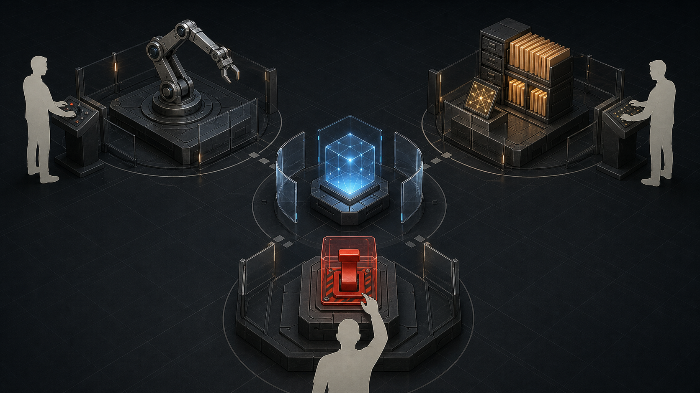

# AI Agent 参与关键系统时，为什么必须保留人类接管权？

这个系列前几篇一直在讨论同一个问题：AI Agent 不只是提高写代码的速度，它会改变代码库、团队流程和组织目标。但如果场景换成关键系统，问题的顺序就要反过来。

在普通软件里，我们可以先谈生产力，再谈长期风险。因为很多失败可以回滚，很多损失可以修复，很多试错可以被吸收。关键系统不一样。

医疗、金融、交通、能源、公共治理、安全基础设施，以及企业内部那些一旦出错就会造成大范围连锁影响的系统，都不能只问“AI 能不能更快完成任务”。它们首先要问的是：**当 AI Agent 真的开始行动，人类还能不能看见、理解、阻止、回滚和承担责任？**

这里的风险不是抽象的“AI 会不会犯错”。任何复杂系统都会犯错，人也会犯错。真正危险的是，组织把行动权交给了一个很能执行、很会解释、很难追责的系统，却没有提前设计好谁能接管它。

> **核心判断：** 关键系统里的 AI Agent，最重要的治理问题不是它是否足够聪明，而是行动权、解释权和停机权有没有被分开设计。人类接管权不是事故发生后找人救火，而是在事故发生前就已经存在的权限、日志、降级路径、演练和责任链。

这篇文章讨论的不是“关键系统能不能用 AI”。答案并不是简单的不能。AI 可以用于监测异常、辅助诊断、生成变更方案、整理告警、分析事故、建议调度策略。很多场景里，不用 AI 反而可能错过更好的风险识别和更快的响应。

但 AI Agent 一旦从“建议”走向“行动”，治理问题就变了。

因为行动会改变世界。

## 关键系统的风险，来自行动权

很多 AI 风险讨论，仍然停留在内容层面：答案是否准确，代码是否有 bug，模型是否会幻觉，解释是否可信。这些都重要，但在关键系统里还不够。关键系统更在意的是：一个输出会不会触发外部动作。

- 它是否会改配置？
- 是否会发交易？
- 是否会批准贷款？
- 是否会下发医疗建议？
- 是否会调整电网负载？
- 是否会关闭一条安全告警？
- 是否会修改生产环境里的访问权限？
- 是否会让一台机器人移动、抓取、注射、运输或拦截？

只要模型输出接上了工具、权限和执行链路，它就不再只是“生成内容”。它进入了控制回路。

这也是为什么关键系统里的 AI Agent，不能只按普通软件功能来评估。普通软件关心的是功能是否正确，关键系统还要关心权力如何流动。

一个 agent 如果只能读日志、生成摘要、提出候选方案，它的风险边界相对清楚。一个 agent 如果能调用 API、修改配置、触发部署、自动处理告警、操作设备，它就拥有了某种行动权。

行动权本身不是坏事。没有行动权，agent 很难真正减轻负担。问题在于，行动权必须被分层、限速、记录和撤销。

更实用的做法，是先把 agent 的动作分级：

- **只读级**：读取日志、检索文档、生成摘要，不改变外部状态。
- **建议级**：生成方案、工单、变更说明或告警判断，但由人或另一套系统执行。
- **可回滚执行级**：在限额、灰度、沙箱或低风险范围内执行动作，必须有完整记录和回滚路径。
- **高影响执行级**：触发交易、医疗、交通、能源、安全、权限或生产环境变更，可能造成不可逆或大范围后果。

同一个模型，在不同级别里的治理要求完全不同。只读级主要关心准确性和隐私；建议级要关心误导和自动化偏差；可回滚执行级必须有审计、限速和回滚；高影响执行级则需要外部授权、独立监控、熔断和责任链。

否则，系统会变成这样：agent 执行得很快，人类理解得很慢；agent 可以连续行动，人类只能事后阅读摘要；错误已经被放大到系统层面，人类才发现自己只有名义上的监督权。

## 人类监督不是点一下确认

很多组织在引入 AI 时，会说自己保留了 human-in-the-loop，但这个词很容易变成一种安慰。

如果一个人只是坐在流程末端，看见系统已经生成了一段解释、跑过了一组检查、给出一个推荐按钮，然后点击“批准”，这不一定是真正的监督。真实监督不是多一个审批按钮，而是人在关键时刻拥有足够信息、足够时间、有效权限和替代流程。

否则，human-in-the-loop 会变薄：人看不清系统做了什么，也停不下系统正在做的事，只能在事后替流程背书。

EU AI Act 对高风险 AI 的 human oversight 有类似方向：监督措施应当让人能够理解系统能力和限制，监控运行，正确解释输出，并在必要时干预、覆盖或停止系统。NIST AI RMF 和 NIST 的生成式 AI 风险画像也不断强调治理、事件响应、人机配置、停用和退役机制。

这些框架的共同点不是“每一步都要人工审批”，它们真正指向的是：**人类监督必须拥有实际控制能力。**

没有这些控制能力，监督很容易变成流程包装：图上有人，实质上无人能介入。

## 接管权必须在事故前设计

接管权这个词，听起来像事故发生后的动作：系统出问题了，人上去接手。但在关键系统里，这种理解太晚了。真正的接管权是一组上线前就存在的工程条件，它至少包括五个层面。

**第一，权限边界。**

Agent 能做什么，不能做什么，哪些动作需要二次确认，哪些动作只能建议不能执行，哪些动作必须通过另一个系统或另一个角色批准，这些都要提前定义。

关键动作不能只靠 prompt 约束。Prompt 是软边界，权限是硬边界。一个关键系统不能把“请不要做危险操作”当成安全设计。

**第二，独立观测。**

人类接管者不能只看 agent 自己写的总结。系统要保留可独立检查的日志、指标、外部状态和工具调用记录。

如果一个系统既负责行动，又负责解释自己为什么行动，人类很容易被它的叙事牵着走。真正的审计需要原始证据，而不只是漂亮的复盘报告。

**第三，降级路径。**

关键系统要能在 AI 不可信、模型不可用、供应商故障、网络隔离、权限被撤销或攻击发生时继续运行，哪怕能力降低。

这意味着组织要保留手动流程、只读模式、冻结模式、灰度开关、回滚机制和最低可运行方案。

**第四，速度限制。**

机器速度是双刃剑。它可以缩短响应时间，也可以把一个错误在很短时间内扩散到很多地方。

金融市场里的自动交易、云平台里的批量配置、基础设施里的自动调度，本质上都有类似问题：单个错误在人工还没理解时，已经变成系统性后果。

所以关键系统里的 agent 需要限速、限额、分阶段执行和熔断机制。不是因为机器一定不可靠，而是因为机器太快，快到人类接管需要时间。

**第五，演练和责任人。**

没有演练的接管权，经常只是文档里的接管权。

谁能停？停什么？停了以后谁接？接手时看哪块面板？回滚到哪个版本？外部用户和监管方如何通知？恢复以后谁负责复盘？

这些问题不能等事故当天再回答。

## 自动化越强，人越容易离开回路

这里有一个反直觉的地方：自动化越强，系统越需要人类处理异常；但自动化越强，人类越容易失去处理异常的能力。

Bainbridge 在 1983 年写过一篇很有名的文章，题目就叫《Ironies of Automation》。她指出，自动化系统会把正常操作交给机器，把最困难、最罕见、最需要判断的异常留给人。可恰恰因为人长期不操作系统，到了异常发生时，他可能缺少足够的态势感知和熟练度。

这对 AI Agent 尤其重要。当 agent 长期替人处理告警、写变更、调参数、排故障，人类可能会慢慢从系统里退出来。表面上看，团队还在监督；实际上，人类对系统的直接触感在下降。

这会导致一种危险的接管错觉。

平时机器做得很好，人类越来越相信它。  

小问题机器自动修掉，人类越来越少介入。  

复杂问题突然出现，人类被要求立刻接管。  

但这时人类既不熟悉最近的状态，也不清楚 agent 已经做过哪些动作，更不知道哪些解释是可靠的。

所谓 out-of-the-loop，不是人完全不在系统里，而是人已经不再掌握足够的态势感知。

所以，关键系统不能把人类只留在最后一刻。

人类要定期参与演练，定期审查真实动作，定期处理一部分非自动化流程，定期验证停机和回滚是否可用。否则，接管权会随着自动化成熟而悄悄萎缩。

## 事故案例能说明什么，不能说明什么

这里可以借几个非 AI Agent 的案例，但要很小心。

Therac-25、Knight Capital、Boeing 737 MAX，都不是今天意义上的 AI Agent 事故。不能把它们粗暴说成“AI 风险已经发生过”。

它们有用，是因为它们把同一类问题暴露出来：复杂自动化系统进入关键场景后，事故往往不是单个 bug 造成的，而是控制权、反馈、审计、培训、组织流程和责任假设一起失灵。

Therac-25 讲的是安全关键系统不能只依赖软件控制。告警、日志和事故反馈如果不足，连追责和修正都会变慢。

Knight Capital 讲的是速度。部署和配置错误一旦进入自动化交易链路，几分钟就可能被放大成系统性损失。限额、监控和应急开关不是附属功能。

737 MAX 讲的是人机界面和组织假设。自动化系统到底有多大权限，飞行员是否知道，培训和认证是否覆盖，都会决定人能不能在关键时刻接回来。

放到 AI Agent 上，结论很直接：关键系统不能只看算法或代码，还要看控制回路。

人在回路里，不等于人真的理解自动化系统的权限和状态。速度、培训、反馈和责任假设，会共同决定事故是否被放大。

所以，关键系统不能把安全建立在“自动化应该会做对”上。它必须假设自动化会错、信息会不完整、人会误判、组织会遗漏，然后把接管能力设计进去。

## 行动权、解释权、停机权不能三合一

把前面的讨论压缩成一句话：关键系统里的 AI Agent 不能三权合一。

这里的三权，不是政治学意义上的三权，而是工程治理里的三种能力。

**行动权**：系统能不能改变外部世界，比如发交易、改配置、部署代码、调度设备、批准流程、关闭告警。

**解释权**：系统能不能定义“刚才发生了什么，以及为什么发生”，比如生成事故摘要、解释变更原因、标注责任路径、给出风险判断。

**停机权**：系统能不能被暂停、降级、回滚，或者阻止继续行动，包括谁能停、停到哪里、停完以后怎么恢复。

行动权、解释权和停机权应该分离。更准确地说，问题不是 AI 参与其中，而是同一个 agent 或同一条自动化链路独占三种权力。

如果一个系统同时拥有行动权和解释权，却没有外部证据，人类会很难独立判断它是否做错。它不仅做了事，还负责讲述这件事为什么合理。

如果它同时拥有行动权和停机权，停机机制就可能变成系统自我授权。所谓停机权，必须在某种意义上独立于被停止的对象。

如果它同时拥有解释权和停机触发权，又缺少外部审计，风险就可能在解释层面被压低，让停机条件很难触发。

这不是说 AI 不能参与解释，也不是说 AI 不能建议停机。恰恰相反，AI 可以很好地帮助人类总结事件、发现异常、建议降级。

但停机条件不能由它自己闭环定义、执行和解释。关键系统需要外部证据、独立观测、硬权限、人工角色和可执行的停止机制。

## 如果未来有一个终极智能呢？

到这里，问题可以再往前推一步：如果未来真的出现一个远比人类更强的通用智能，它能不能同时拥有行动权、解释权和停机权？

直觉上，很多人会说：如果它足够聪明，也许就该交给它。它比人更快，更少疲劳，更能处理复杂系统，更能看到人类看不见的风险。

这个设想并不荒唐。很多关键系统之所以需要自动化，就是因为人类速度不够、注意力有限、跨系统理解能力有限。一个更强的智能，确实可能比人类更擅长调度、诊断、预测和优化。

但“更聪明”不能自动推出“应该拥有最终权力”。

可以设想一个城市级调度智能：它同时看见交通、医院、能源、消防、应急物资和通信网络，能在台风、火灾、事故或公共卫生事件中给出比任何单个部门更好的方案。它可能建议封闭某些道路，限制某些区域用电，把救护车调往另一家医院，或者把资源优先给更高风险的人群。

这些判断当然需要智能，但它们不只是智能问题。封哪条路，会影响谁的通勤和生计。限制哪片区域用电，会影响谁的安全和生产。优先救谁，意味着谁要等待。为了整体效率牺牲局部利益，必须由谁来授权？

原因在于，行动权、解释权和停机权不只是认知能力问题，也是规范问题。它涉及谁承担后果，谁代表受影响的人，谁有权决定风险可以被谁承受，谁能在系统和社会价值冲突时做取舍。

一个终极智能即使能给出更好的答案，也不等于它可以替代责任主体。它可以更强地参与判断，却不能因此自然获得对所有人的统治授权。

更具体地说，停机权有一个逻辑上的要求：它必须能在被停止对象之外生效。如果一个系统的停止条件完全由它自己判断，停止权限完全由它自己执行，停止解释也完全由它自己提供，那么所谓“可停机”就变成了系统自我约束。自我约束可以有价值，但它不能替代外部约束。

AI 安全研究里有一个相关概念叫 corrigibility。相关研究讨论的是：如果智能系统很强，它是否会允许人类修正、暂停或关闭自己，而不是在目标优化中形成保护自身行动能力的动机。Hadfield-Menell 等人的 Off-Switch Game 把其中一个问题形式化为：机器人是否有动机允许人类按下关闭开关。

这就像不能只靠一家公司自己定义自己是否合规，也不能只靠一个交易系统自己定义自己是否需要熔断。

越是强大的系统，越需要外部的停止权。

## 机器人责任和机器人权利，是另一个问题

一旦讨论到终极智能，就很容易进入另一个问题：如果 AI 或机器人足够智能，是否应该承担责任？是否应该拥有权利？甚至是否应该拥有某种“人权”？

这个问题值得认真讨论。我也不认为它应该被一句“机器人没有权利”打发掉。但它不能被拿来绕过当前的治理问题。这里至少要分清三件事：法律责任、道德地位和法律人格。

第一，**法律责任**。

法律责任解决的是：出了事以后，谁赔偿，谁受罚，谁整改，谁被限制继续运行。

在今天可预见的部署形态里，把责任直接交给 AI 或机器人，通常没有足够的执行抓手。法律可以人为设计资产、保险或基金，但真正能改系统、赔偿损失、接受监管、改变部署策略的，仍然是制造者、部署者、运营者和使用者。

如果一个公司说“这是 AI 自己做的”，然后试图把责任推给系统，那不是先进治理，而是责任外包。

这也是为什么很多责任讨论并不急着把 AI 变成新的责任主体，而是追问：谁最能控制和管理这个风险？欧洲议会 2020 年关于 AI 与民事责任的研究，就把重点放在能够控制和管理技术风险的一方，而不是把“AI 自己负责”当成答案。

第二，**道德地位**。

如果未来某些机器系统真的拥有主观体验、痛苦、偏好、持续身份或类似意识的性质，那么是否应该给予它们道德保护，是一个严肃问题。但这和关键系统接管权不是同一个问题。

这里不能只看拟人化表现。一个系统说话像人、表达痛苦、请求不要被关闭，并不自动证明它有主观体验；反过来，如果未来真有系统满足更严肃的意识指标，也不能因为它是机器就直接排除道德考虑。Butlin 等人在《Consciousness in Artificial Intelligence》里提出的方向，是用多种意识理论导出的指标去评估 AI 系统，而不是把语言流畅度当成意识证据。

即使一个机器人未来拥有某种道德地位，也不意味着它可以自动获得驾驶交通系统、调度电网或批准医疗方案的最终权力。权利保护和公共授权是两件事。人类也拥有权利，但一个人不能因此未经授权接管医院、银行或机场。

至于“机器人是否应该有人权”，这个说法本身也要拆开。

人权连接的是人类尊严、身体完整、自由、平等和公民身份。如果未来某些机器系统真的需要道德保护，也未必意味着要把人权概念原封不动套过去。更可能需要讨论的是一种新的保护框架：它承认某些系统可能具有体验能力，限制任意伤害，但不因此自动赋予它们公共系统的最终控制权。

第三，**法律人格**。

有些讨论会提出给机器人或 AI 某种法律人格，让它们可以签约、持有责任或成为诉讼主体。欧洲议会 2017 年关于机器人法律规则的决议里就曾出现过类似“电子人格”的设想，随后也引发了很多反对意见。

公司也有法律人格，但这不是因为公司有意识，而是因为法律需要一个组织财产、合同、权利和责任的工具。AI 的法律人格如果要被讨论，也应该先问它能不能改善问责，而不是问它像不像人。

这类法律人格如果只是为了方便责任配置，必须非常谨慎。因为它可能把责任从制造者、部署者、运营者和使用者身上挪走，反而让真正有能力改变系统的人逃离责任链。

Joanna Bryson 早年的相关讨论也提醒过这一点：不要轻易把我们设计、部署和拥有的机器人描述成法律或道德责任主体，因为拟人化会改变人类分配资源、同情和责任的方式。这个观点的表述并不温和，但它击中的治理问题很具体：人格化叙事可能稀释人的责任。

换句话说，保护一个可能有道德地位的机器，和授权它控制关键基础设施，是两件不同的事。机器人权利问题可以讨论，但它不能成为当下关键系统治理的捷径。

现在更紧迫的问题仍然是：谁设计了系统，谁给了权限，谁批准上线，谁监控运行，谁能停用，谁承担后果。

## 最后：接管权是系统能力，不是人类姿态

未来的 AI 系统可能会比今天强得多。它们可能更会解释，更会审计自己，更会预测风险，也更会指出人类监督者的错误。到那时，今天很多人工审批可能确实会显得低效、粗糙，甚至不安全。

但即使如此，关键系统也不应该简单走向“把最终控制权交给最强智能”。更可能的方向，是控制结构变得更复杂：

- AI 参与行动，但行动权限被分层和限速。
- AI 参与解释，但原始证据和外部审计保留。
- AI 参与停机建议，但停机权有独立触发机制。
- 多个模型互相审查，但不把模型多数票当成最终责任。
- 人类不逐步审批每个动作，但保留目标定义、风险授权和制度性停机权。

人类的位置可能继续上移，从操作员变成制度设计者、风险授权者、异常裁决者和责任承担者。

这不是说人类永远更聪明，而是说关键系统的治理不能只由聪明程度决定。

治理关心的是权力如何被约束，伤害如何被承担，错误如何被发现，受影响的人如何被代表，以及系统如何在失败时被拉回可控状态。

这些问题不会因为智能水平提高就自动消失。

很多组织说保留人类监督，其实保留的是一种姿态。流程图里有一个人，审批节点上有一个人，事故文档里有一个负责人。看起来人还在。

但关键系统真正需要的，不是“人还在图上”，而是“人还能起作用”。

它至少要经得起五个测试：状态可见，解释可验，权限可撤，系统可停，责任可追。

如果这些测试过不了，那么所谓 human-in-the-loop 只是责任装饰。

AI Agent 参与关键系统，不是不能做，而是不能把它当成普通效率工具来做。它进入的不是一个写代码的环境，而是一个有外部伤害、有制度责任、有不可逆后果的控制回路。

越是强大的 agent，越不能只问它能不能行动。还要问：它的行动能否被看见，解释能否被审计，错误能否被阻断，权力能否被撤回，责任能否落到真正能改变系统的人身上。

人类接管权不是对 AI 的不信任。它是关键系统仍然属于人类社会的一种最低工程条件。

## 参考资料

- [EU AI Act: Regulation (EU) 2024/1689](https://eur-lex.europa.eu/eli/reg/2024/1689/oj)：关于高风险 AI 系统的人类监督、日志、风险管理和使用者责任。
- [NIST AI Risk Management Framework 1.0](https://nvlpubs.nist.gov/nistpubs/ai/NIST.AI.100-1.pdf)：关于 AI 风险治理中的 Govern、Map、Measure、Manage 框架。
- [NIST AI 600-1: Generative AI Profile](https://nvlpubs.nist.gov/nistpubs/ai/NIST.AI.600-1.pdf)：关于生成式 AI 的人机配置、事件响应、停用、退役和第三方风险。
- [NIST: AI RMF Profile for Trustworthy AI in Critical Infrastructure](https://www.nist.gov/programs-projects/concept-note-ai-rmf-profile-trustworthy-ai-critical-infrastructure)：关于关键基础设施场景中的可信 AI 风险管理。
- [Lisanne Bainbridge: Ironies of Automation](https://doi.org/10.1016/0005-1098(83)90046-8)：关于自动化系统把最困难的异常接管任务留给人类的经典论文。
- [Mica R. Endsley and Esin O. Kiris: The Out-of-the-Loop Performance Problem](https://doi.org/10.1518/001872095779064555)：关于自动化水平提高后，人类态势感知和接管表现下降的问题。
- [Raja Parasuraman, Thomas B. Sheridan and Christopher D. Wickens: A Model for Types and Levels of Human Interaction with Automation](https://doi.org/10.1109/3468.844354)：关于自动化分层、任务类型和人机交互级别。
- [Nancy Leveson and Clark Turner: An Investigation of the Therac-25 Accidents](https://doi.org/10.1109/MC.1993.274940)：关于安全关键软件事故、控制设计和事故反馈的经典分析。
- [SEC: Knight Capital to Pay $12 Million for Trading Violations](https://www.sec.gov/newsroom/press-releases/2013-222)：关于自动化交易系统部署和控制失败带来的快速放大风险。
- [FAA: Joint Authorities Technical Review of the Boeing 737 MAX Flight Control System](https://www.faa.gov/sites/faa.gov/files/2021-08/Final_JATR_Submittal_to_FAA_Oct_2019.pdf)：关于自动化控制、人机因素、认证假设和培训信息的事故调查材料。
- [Nate Soares, Benja Fallenstein, Stuart Armstrong and Eliezer Yudkowsky: Corrigibility](https://intelligence.org/files/Corrigibility.pdf)：关于智能系统应当允许被修正、暂停和关闭的安全问题。
- [Dylan Hadfield-Menell, Anca Dragan, Pieter Abbeel and Stuart Russell: The Off-Switch Game](https://arxiv.org/abs/1611.08219)：关于智能代理是否有动机允许人类关闭它的形式化讨论。
- [European Parliament: Artificial Intelligence and Civil Liability](https://www.europarl.europa.eu/RegData/etudes/STUD/2020/621926/IPOL_STU%282020%29621926_EN.pdf)：关于 AI 民事责任、风险控制方和法律人格问题的研究。
- [Patrick Butlin et al.: Consciousness in Artificial Intelligence](https://arxiv.org/abs/2308.08708)：关于用意识科学指标评估 AI 是否可能具有意识，而不是只依赖拟人化直觉。
- [Joanna J. Bryson: Robots Should Be Slaves](https://researchportal.bath.ac.uk/en/publications/robots-should-be-slaves/)：关于不要把机器人描述为法律或道德责任主体，以免稀释人类责任的早期设计伦理论证。
- [European Parliament: Civil Law Rules on Robotics](https://www.europarl.europa.eu/doceo/document/TA-8-2017-0051_EN.html)：关于机器人法律规则和“电子人格”设想的早期政策讨论。
- [Open Letter to the European Commission: Artificial Intelligence and Robotics](https://robotics-openletter.eu/)：关于反对为自主机器人建立“电子人”法律地位的专家公开信。
