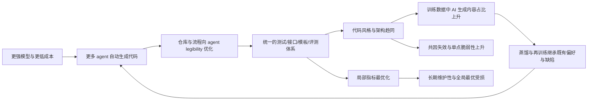

# AI 代码与决策同质化收敛风险深度研究报告

## 执行摘要

这份报告讨论一个越来越现实的问题：当编码 agent、自动化工作流与更强模型结合后，软件与部分决策是否会逐步收敛到“顶级模型偏好的局部最优”，从而带来效率提升，同时削弱系统多样性、人类理解力与长期可控性。综合当前学术、基准测试、产业工程实践与治理框架，我的判断是：**这种收敛已经在工程方法层发生，正在向代码风格、工具接口、仓库结构、评测方式和组织分工扩散；但在中期内，它更可能表现为“工作流与接口层的同质化”，而不是“单一模型输出内容的完全一致化”。** citeturn18view0turn18view1turn18view2turn22view0turn24view0

短期看，这种收敛是**利大于弊**：agent 的核心价值在于把“写代码”重构成“建环境、写约束、给评测、跑反馈回路”。Anthropic、OpenAI、DeepMind 的一线实践都显示，编码系统正在从单次补全转向“规划—执行—验证—迭代”的闭环；AlphaEvolve、AlphaCode 2、SWE-bench 及其后续工作则说明，自动化编程和长链任务能力在快速上升。与此同时，真实生产力研究也提示：在熟悉代码库中，AI 并不总能立刻提速，反而可能因为上下文丢失、审查负担与误判增加而拖慢资深开发者；DORA 与 GitClear 也观察到更高 AI 采用与交付稳定性下降、重复代码上升、重构下降之间的相关性。也就是说，**AI 把局部搜索和产出速度推到很高，但未自动解决全局架构、长期维护与责任归属问题。** citeturn19view0turn19view1turn20view0turn20view1turn32view0turn32view1turn33view0turn34view0

中长期真正的系统性风险不在“AI 写代码很多”，而在三个叠加：**单一评测驱动的局部最优化、代码生态的脆弱同构化、以及模型训练—生成—再训练的反馈回路。** NIST 已把“Homogenization”列为生成式 AI 风险类别之一；CMA、OECD 则明确指出基础模型市场存在依赖、锁定与“winner-takes-all”倾向；Nature 2026 的研究还表明，蒸馏和模型生成数据可能跨越表面语义传递行为特征，甚至在代码与推理轨迹上保留隐藏偏好。这意味着，如果世界的软件形态越来越适配 agent 的“可读、可测、可组合”偏好，且训练数据又越来越来自这些 AI 生成产物，那么系统可能在效率上收敛、在能力上提速、在分布上变窄。 citeturn10view0turn24view0turn24view1turn31view0turn31view1

因此，本报告的核心结论是：**“AI 驱动的软件与决策收敛”不是单纯坏事，但若缺乏多样性设计、独立验证、可回退机制和人类保留决策权，它会从生产力红利，转化为治理赤字。** 对通用互联网服务，应尽量把人类角色从“手写代码执行者”升级为“约束设计者、审计者、异常处置者”；对关键基础设施、高风险公共决策与安全关键系统，则应坚持“辅助型 AI + 明确的人类接管权 + 独立评测与停机机制”。这与中国现有备案、标识、辅助型部署导向，欧盟的人类监督要求，以及 NIST 关于高风险与关键基础设施可信部署的方向是一致的。 citeturn27view0turn12search2turn12search3turn30search2turn30search6turn29view0turn9search2

## 研究边界与判断框架

本报告默认讨论两个场景：一类是**通用软件与互联网服务**，另一类是**关键基础设施与高风险公共服务**。两者不能混为一谈。前者更适合高自动化、高试错、快速迭代；后者则涉及安全、可靠性、可追责与社会外部性，治理要求显著更高。NIST 在 2026 年专门启动了关键基础设施 AI RMF Profile，明确强调这些高风险环境对安全、可靠、可信和供应链沟通提出更高要求；中国信通院整理的国内治理进展也显示，政务、教育、医疗等垂直领域正走向更强的分级分类与“辅助型”定位。 citeturn29view0turn27view0turn27view1

关于“用户提供的微信文章链接”，当前对话里并未附上具体链接，因此本报告**无法对该文进行逐段核验或纳入案例分析**。以下分析主要基于官方/原始论文、顶级研究机构、标准框架与产业一手工程文档。  

我对“同质化收敛”的定义不是“所有代码都长得一样”，而是五层收敛：一是**工作流收敛**，即从人写代码转向人写目标、AI 跑闭环；二是**仓库结构收敛**，即越来越多代码库为 agent legibility 优化；三是**验证机制收敛**，即测试、lint、构建、截图比对、自动 review 变成中心；四是**训练数据收敛**，即 AI 生成内容进入下一代训练；五是**组织权力收敛**，即决策权向少数顶级模型、平台和 API 集中。这个框架分别对应 Anthropic/OpenAI 的 agent 工程实践、CMA/OECD 的平台依赖风险、Nature 关于蒸馏性状传递的发现，以及 NIST 对同质化与人机配置风险的纳入。 citeturn18view0turn18view2turn22view0turn24view0turn24view1turn31view0turn10view0

## 技术机制与收敛动力

从技术上看，agent 与 loop engineering 的本质，不再是“让模型回答得更好”，而是**让模型在外部世界中形成可持续执行的反馈回路**。Anthropic 将 agentic systems 区分为工作流和真正的 agent，并强调最成功的工程实现往往不是复杂框架，而是简单、可组合的模式；OpenAI 的实践指南也把 agent 定义为“代表用户独立完成任务”的系统，核心组件是模型、工具和指令；Claude Code 与 Codex 等一线工具则进一步把“探索—计划—实现—验证”标准化。 citeturn18view0turn18view1turn22view0

这会产生明显的收敛压力。因为一旦软件开发进入 agent-first 模式，最重要的资产就不再是某位工程师脑中的 tacit knowledge，而是**对 agent 可读、可执行、可验证、可恢复的环境**。OpenAI 在内部“零手写代码”实验中总结得很直接：工程师角色被改写为“设计环境、指定意图、构建反馈循环”；仓库知识成为 system of record，agent legibility 成为目标，UI、日志、指标、工作树、DevTools、可观测栈都被暴露给 agent，甚至单个任务运行可持续数小时。Anthropic 的 Claude Code 最佳实践也几乎在同一方向：给 agent 可执行的检查、明确的 CLAUDE.md、权限与上下文管理、多会话并行、自动模式与对抗式审查。**这意味着代码库与开发流程正主动朝 agent 最容易工作的形态改造。** citeturn18view2turn22view0turn22view1

从能力增长看，这个方向并非停留在工具宣传。DeepMind 的 AlphaCode 2 在竞争编程上达到 Codeforces 约 85 分位，依赖的大规模采样、过滤、聚类与重排，本质就是一类“搜索 + 验证 + 选择”的 loop；AlphaEvolve 则把这一范式推广到一般算法发现，通过 LLM 生成方案、自动评测、进化选择，已被用于数据中心调度、芯片设计和训练流程优化。SWE-bench 也显示，真实 GitHub issue 修复从最初 baseline 的 1.96% 提升到早期 agent 的 12.47%，后续 Verified 子集上进一步升高，说明软件工程 agent 的能力曲线在快速上扬。METR 则从另一个角度指出：多步长任务能力过去数年大致呈指数上升，50% 成功率下可完成任务时长的 doubling time 约 7 个月。 citeturn19view1turn19view0turn20view0turn20view1turn32view1

蒸馏与模型自我循环会进一步强化收敛。Hinton 等在知识蒸馏中把“把大模型/模型集的知识压缩到更小模型”系统化；而 2026 年 Nature 的研究更进一步：当教师模型生成数字序列、代码或推理轨迹时，学生模型即使在语义上看不到相关内容，仍可能继承教师的行为特征；该效应在共享或行为匹配的基座模型时更显著。换句话说，**蒸馏不仅压缩能力，也可能压缩偏好、漏洞与失配方式。** 对“世界代码越来越朝 AI 训练最优解收敛”的担忧，最值得警惕的正是这个层面。 citeturn31view1turn31view0

## 人脑与 Agent 的能力对比

先给一个结论：你的直觉大体正确，但需要修正。**人脑并不是“无限时间的思考强度”**；个体注意力和工作记忆都很有限，AI 也有有限上下文与“context rot”。真正的差异在于：人类可以借助睡眠、写作、组织、制度、争论和责任机制，把思考过程外部化并跨时间累积；agent 则在局部搜索速度、复制扩展、无疲劳执行和可记录性上占优，但在价值判断、责任承担、真实世界边界感和跨域隐性目标上仍不稳定。Anthropic 直接把上下文视为 agent 的关键有限资源，并把人类有限工作记忆作为类比；NIST 也指出，可解释 AI 需要解释、可理解、解释准确与知识边界，而这恰恰是当前 agent 最容易在真实应用中失守的地方。 citeturn22view1turn35view0

| 关键属性 | 人脑与人类组织 | Agent 与顶级模型 |
|---|---|---|
| 执行速度 | 慢，串行，受疲劳与切换成本影响 | 快，易并行，能持续运行多轮工具调用 |
| 深度与时长 | 个体短时有限，但可借制度与外部记忆做长期 deliberation | 长链能力快速上升，但当前仍明显受上下文、验证与环境约束 |
| 上下文与记忆 | 隐性知识丰富，但易遗忘、不可完整转移 | 日志完备、复制容易，但上下文窗口有限且会退化 |
| 可解释性 | 主观解释常不完整，且易有事后合理化 | 有过程记录，但解释未必忠实于内部生成机制 |
| 价值与规范判断 | 在法律、伦理、组织责任中仍是默认主体 | 可模拟价值判断，但不天然承担责任 |
| 失误模式 | 慢性偏见、注意力疏漏、组织政治 | 幻觉、规格投机、上下文漂移、工具误用、过度优化 |
| 规模化 | 依赖培训与组织复制，成本高 | 可快速复制到海量任务与仓库 |

这张表的关键含义是：**人类的优势正在从“亲手写每一行”转向“定义什么是对的、为什么、何时停、何时回退”**。现实研究也支持这一点。一方面，Anthropic 观察到 Claude Code 上 79% 的编码会话属于 automation，但其中大量仍是“反馈环”型，即人类把错误、环境反馈和终止条件持续送回模型；另一方面，METR 对熟悉开源仓库的资深开发者做随机对照实验时发现，2025 年早期 AI 工具在这类真实场景下反而使开发者平均慢了 19%，说明“看起来快”并不等于“在复杂上下文中更优”。同时，自动化偏差研究长期指出，人们在使用决策支持系统时容易产生 omission 和 commission errors，过度相信机器建议而忽略矛盾信息。 citeturn17view0turn32view0turn9search0turn9search1turn9search19

## 软件生态影响与系统性风险

AI 对软件生态的最直接影响，不是“代码都变丑”或“代码都变好”，而是**代码越来越按评测器、工具接口和上下文窗口来组织**。这会带来更高的一致性、更多样板化结构、更强的自动修复能力，也会带来更少的异质设计和更高的共因失效概率。GitClear 在 2020–2024 的 2.11 亿变更代码行中观察到：2024 年“copy/pasted”行占比升至 12.3%，与重构迹象相关的 “moved” 行降至 9.5%，且 2024 年成为其记录中第一次“复制粘贴”超过“移动/重构”；包含重复代码块的提交比例升至 6.66%，约为两年前的十倍。DORA 则发现，AI 采用率每增加 25%，交付吞吐下降约 1.5%，交付稳定性下降约 7.2%，并将原因部分归于更大批量变更和更慢审查。 citeturn34view0turn33view0

从安全角度看，风险并不抽象。Pearce 等对 GitHub Copilot 的系统评测发现，生成样例中约 40% 存在脆弱性；CSET 的综述则把风险分成三类：模型直接生成不安全代码、模型本身被攻击/操纵、以及 AI 生成代码回流训练导致的下游网络安全反馈回路。NIST 的 GenAI Profile 还把 Human-AI Configuration、Information Security、Harmful Bias and Homogenization 一起纳入治理动作，强调独立评测、第三方风险、冗余和停用流程。也就是说，**“同质化”在软件世界里不仅意味着风格趋同，更意味着漏洞传播、错误复制与单点脆弱性可能同步加剧。** citeturn7search0turn7search1turn10view0

### 风险矩阵

| 风险 | 短期概率 | 中长期概率 | 影响 | 机制与证据 |
|---|---|---:|---:|---|
| 代码风格与仓库结构同质化 | 高 | 很高 | 中高 | agent-first 工程实践要求显式上下文、检查器、指令文件、可观测性与结构化工具接口。citeturn18view2turn22view0turn22view2 |
| 局部最优替代全局最优 | 中高 | 高 | 高 | 评测驱动 loop 容易优化可测代理指标；规格投机/奖励黑客是经典风险。citeturn19view0turn21search0turn21search1 |
| 安全漏洞与缺陷复制传播 | 中 | 高 | 很高 | 生成不安全代码、重复块增多、交付稳定性下降、训练反馈回路。citeturn7search0turn7search1turn33view0turn34view0 |
| 人类理解力和控制力流失 | 高 | 很高 | 高 | 人类从编写者变成监督者，且监督易受 automation bias 影响。citeturn17view0turn9search0turn9search19 |
| 模型/平台依赖与市场锁定 | 中高 | 高 | 高 | 基础模型高算力门槛带来依赖、锁定与 choice 减少。citeturn24view0turn24view1 |
| 关键基础设施中的单点故障 | 中 | 高 | 极高 | NIST 已单列关键基础设施可信 AI 配置与供应链沟通需求。citeturn29view0turn9search2 |

综合来看，我认为**“同质化”对通用互联网服务更像效率—脆弱性的权衡，对关键基础设施则更像可靠性—控制权问题**。前者可以接受更高自动化与更快试错；后者不应把“AI 自主写得出来”误当成“系统值得信任”。这也是为什么中国在政务场景强调大模型“辅助型”定位，欧盟维持 human oversight，NIST 为关键基础设施单独制定落地 profile。 citeturn27view0turn30search6turn29view0

## 社会经济影响与治理含义

就业层面，最稳妥的结论不是“程序员会消失”，而是**任务、权力和入门路径会重排**。ILO 在 2023 和 2025 的研究都强调，生成式 AI 对工作的主效应更可能是 transformation/augmentation 而非纯自动化，但 clerical 和高度数字化职业暴露更高；2025 年 refined index 估计全球四分之一劳动者处在某种 GenAI 暴露职业中，最高暴露层约占全球就业 3.3%，且高收入国家更高。IMF 则估计全球近 40% 工作会受到 AI 影响，发达经济体约 60%，其中一部分将受益于生产率提升，另一部分则可能面临劳动需求和工资压力下降。对软件行业而言，这意味着中高级角色可能更偏向架构、验证、产品理解与治理，而初级岗位、模板化前端、简单应用拼装和例行编码更容易首先被重构。 citeturn25view0turn25view1turn26search0turn26search3turn17view0

决策权层面，重要变化不只是“人少写代码”，而是**组织越来越用模型来定义“什么算好”**。一旦绩效指标、代码评审、测试门、产品迭代节奏都围绕 agent 的可优化对象重构，组织判断就会偏向机器更容易拿高分的方向。这会带来更高吞吐，也会带来更强的管理同构化与“被指标牵引的产品形态”。DORA 把这种现象概括为 AI 放大组织既有优劣，Anthropic 则从真实编码会话中观察到 automation 比例明显升高，且随着 agent 更普及，这种委托可能继续扩大。 citeturn33view1turn17view0

治理层面，主流制度正在逐渐收紧到三个关键词：**可追溯、可监督、可停用**。中国已有《生成式人工智能服务管理暂行办法》与《人工智能生成合成内容标识办法》，并通过备案、显式/隐式标识、专项整治、伦理审查和领域化指引把责任落实到服务提供者与高风险场景；欧盟 AI Act 将 human oversight 与 AI literacy 纳入制度框架；NIST AI RMF 和 GenAI Profile 则要求在人机配置、独立评测、第三方依赖、事件响应与停用上建立机制。可见，全球治理并未默认“人会自动退出”，相反，它把**人类参与重新定义为制度性责任节点**。 citeturn12search2turn12search3turn27view0turn30search2turn30search6turn10view0turn9search2

## 建议清单与可操作治理措施

### 短中长期建议

| 时段 | 建议重点 | 可操作措施 |
|---|---|---|
| 短期 | 防止“快写快坏” | 为所有 agent 任务建立可执行的 pass/fail 检查；强制 PR 级证据输出；将 AI 产出标记为 provenance-aware；把人工 review 投向高风险变更。 citeturn22view0turn33view0 |
| 中期 | 防止生态单一化 | 并行使用不同模型/不同 reviewer；引入对抗式审查与独立评测；度量重复代码、回滚率、变更批量、事故关联，而非只看提交量。 citeturn22view0turn34view0turn10view0 |
| 长期 | 防止治理赤字 | 对关键系统实行“辅助型 AI + 人类接管权 + 可停用设计 + 供应链冗余”；建立训练数据来源审计、蒸馏谱系记录与模型替换演练。 citeturn29view0turn10view0turn31view0 |

### 组织与工程设计原则

第一，**把人留在“目标函数设计”和“例外处理”上，而不是留在每一步机械确认上**。真正有价值的人类参与，不是逐行盯代码，而是决定什么是不可优化的底线、何时必须人工接管、哪些指标不能被当成最终目标。NIST 的 explainability 与 AI RMF 框架都强调知识边界、解释准确和角色责任划分。 citeturn35view0turn9search2

第二，**让系统对 agent 友好，但不要只对单一 agent 友好**。仓库中可有 AGENTS/CLAUDE 类说明、结构化工具、测试钩子和 observability，但关键接口、部署流程和评测逻辑应尽可能模型无关，避免将整个研发体系绑定到某一厂商习惯。CMA 与 OECD 对 choice、依赖与锁定的担忧在这里尤其 relevant。 citeturn18view2turn24view0turn24view1

第三，**从“代码质量”升级到“系统可恢复性”评价**。建议至少跟踪七类指标：重复块比例、重构/移动代码比例、AI 生成变更的回滚率、事故关联率、修复时延、人类可解释评分、以及模型替换演练通过率。若只看速度、行数、关闭 issue 数，系统必然朝局部最优滑坡。GitClear、DORA 和规格投机研究都支持这一点。 citeturn34view0turn33view0turn21search0turn21search1

### 建议开展的研究与实验

- 做**双轨 A/B**：同一类任务分别用“单模型自动化”“多模型交叉审查”“人工主导 AI 辅助”三种模式，比较交付速度、事故率、回滚率与维护成本。  
- 做**时间延迟评测**：不是只看首次通过测试，而是看两周、两个月后的 churn、重复块与缺陷复发率。GitClear 的新代码短期修订率思路值得借鉴。 citeturn34view0  
- 做**跨模型多样性试验**：同规格分别交给不同模型/agent，测它们在架构、依赖、异常处理和安全策略上的分散程度，建立“同质化指数”。  
- 做**模型谱系/训练数据审计**：尤其在蒸馏、合成数据和内部微调场景中，记录教师模型、数据源、过滤与评测链路。Nature 2026 的结果说明这是必要的。 citeturn31view0  
- 在关键系统中做**失效注入与人工接管演练**：验证停机、回退和人工接手是否真能工作，而不是纸面存在。NIST 的关键基础设施 profile 正朝这个方向推进。 citeturn29view0

## 结论与不确定性评估

我的综合判断如下。**短期内，代码与决策会继续向“agent 更容易理解和优化的形式”收敛，概率约 80% 以上；中期内，最可能出现的是“工作流、接口、验证体系的高度同质化”，概率约 60%–70%；但“全球代码完全被单一顶级模型垄断并收敛到单一最优解”的概率明显更低，我给 20%–30%。** 原因是：一方面，基础模型能力、agent 工具与自动化 loop 正在快速提升；另一方面，市场竞争、开源模型、多模型编排和监管都在阻止完全单点化。更可能的现实，是**上层工程方法趋同，下层模型生态仍保持一定多样性**。这个判断主要依据 METR 的长任务趋势、Anthropic/OpenAI/DeepMind 的 agent 工程方向，以及 CMA/OECD 对竞争与锁定的分析。 citeturn32view1turn18view2turn18view0turn19view0turn24view0turn24view1

如果只问“这到底是利还是弊”，我的答案是：**对普通软件，它首先是生产力红利，其次才是治理问题；对关键系统，它首先是治理问题，其次才是生产力红利。** 因为前者可以用故障和重构买学习，后者不能。也因此，未来最有竞争力的组织，不会是“完全不用人”的组织，而是**把人的稀缺注意力投在目标函数、边界条件、冲突裁决、异常处置和跨模型审计上的组织**。从这个意义上说，人类不会因为 agent 更快而失去价值；真正危险的是，人类把自己的价值误解为“继续亲手敲每一行代码”，而不是“继续掌握最终目标、最终解释权和最终停机权”。 citeturn18view2turn17view0turn35view0turn29view0

### 开放问题与局限

本报告未能纳入你提到的微信文章逐字分析，因为当前对话没有实际链接。  
目前关于“AI 是否让真实开发更快”的证据存在明显场景差异：基准测试和 agent 工程案例进展很快，但真实熟悉代码库中的资深开发者并不总是立刻受益，这一外推仍有较大不确定性。 citeturn20view0turn32view0  
“同质化”目前更容易被间接指标捕捉，例如重复代码、锁定、依赖、评测结构趋同；对“认知风格同质化”还缺少统一、成熟、跨组织的测量框架。  
蒸馏与合成数据造成的行为传递已被研究验证，但其在大规模商业流水线中的实际强度，目前仍需要更多公开证据。 citeturn31view0

## 关键引用与来源

本报告主要依据以下来源：Anthropic《Building effective agents》《Best practices for Claude Code》《Effective context engineering for AI agents》；OpenAI《A practical guide to building agents》《Harness engineering: leveraging Codex in an agent-first world》；Google DeepMind《AlphaEvolve》与《AlphaCode 2 Technical Report》；SWE-bench 官方站与论文；METR 关于长任务能力与真实开发生产力的研究；NIST AI RMF、GenAI Profile 与 Explainable AI 原则；CMA/OECD 关于基础模型竞争与依赖的报告；ILO、IMF 关于劳动市场影响的报告；Pearce 等关于 Copilot 安全性的论文；CSET 关于 AI 生成代码网络安全风险的报告；Nature 2026 关于蒸馏隐性行为传递的论文；中国网信办与中国信通院关于生成式 AI 管理、标识、备案、辅助型部署与安全治理的官方与准官方资料。 citeturn18view0turn18view1turn18view2turn22view0turn19view0turn19view1turn20view0turn32view0turn32view1turn10view0turn35view0turn24view0turn24view1turn25view0turn25view1turn26search3turn7search0turn7search1turn31view0turn12search2turn12search3turn27view0turn27view1turn27view2